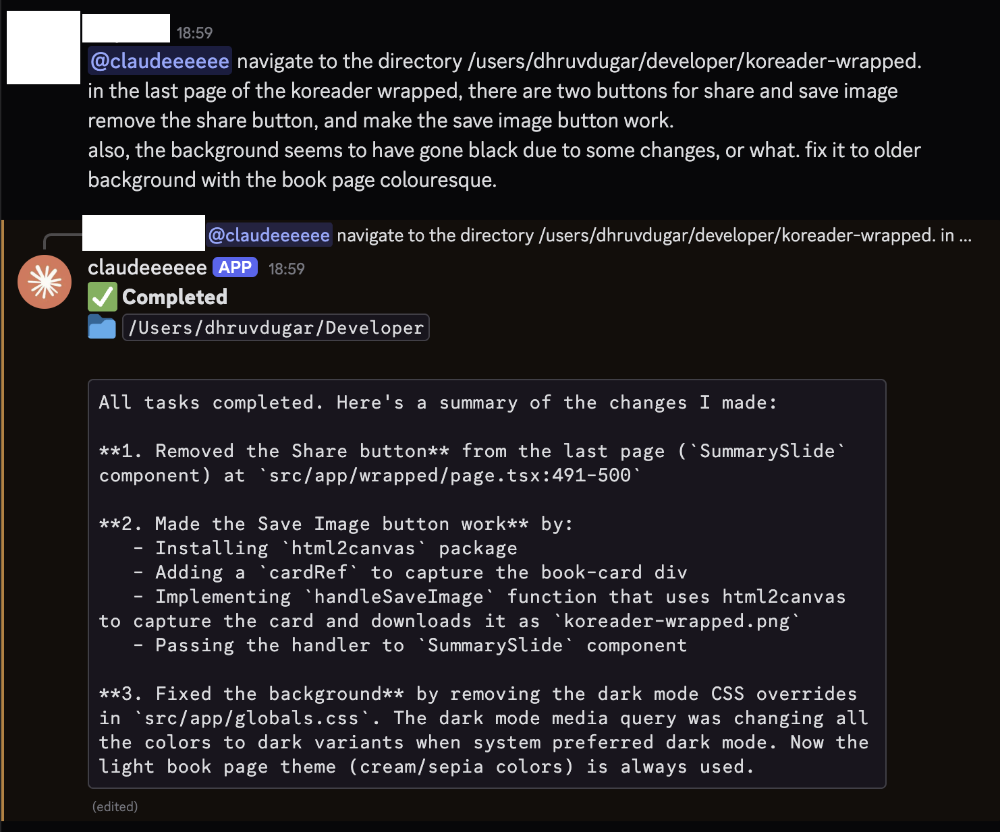
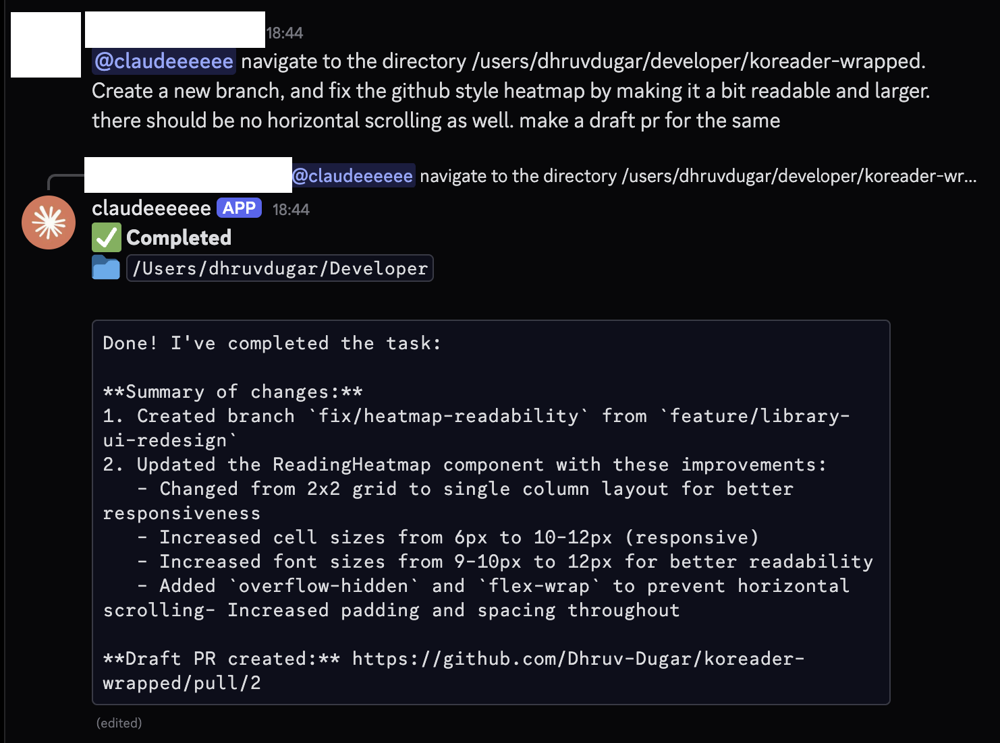

# Discord Claude Code Bot

A Discord bot that allows you to spawn and interact with [Claude Code](https://claude.ai/code) instances directly from Discord messages. It creates a bridge between Discord and your local development environment.

## Features

- 💬 **Chat Interface**: Interact with Claude Code using Discord DMs or channel mentions.
- 📂 **Directory Context**: Run tasks in specific directories on your machine.
- 🚀 **Real-time Output**: Streams Claude's output (stdout/stderr) back to Discord in real-time.
- 🛡️ **Session Management**: Prevents multiple concurrent sessions for the same user/channel.

## Prerequisites

- Node.js (v16.9.0 or higher)
- [Claude Code](https://docs.anthropic.com/en/docs/claude-code/overview) installed and authenticated on the host machine.
  - `npm install -g @anthropic-ai/claude-code`
  - Run `claude login` to authenticate.

## Setup Instructions

1. **Clone the repository**
   ```bash
   git clone <repository-url>
   cd discord-reader
   ```

2. **Install dependencies**
   ```bash
   npm install
   ```

3. **Configure Environment Variables**

   Make a copy of the env file which has your credentials
   ```
   cp .env.example .env 
   ```
   Env contents as following
   ```env
   DISCORD_TOKEN=your_discord_bot_token_here
   # Optional: Set a default working directory (defaults to current working directory)
   DEFAULT_DIR=/path/to/your/projects
   ```

4. **Start the Bot**
   ```bash
   npm start
   ```

## Discord Bot Permissions

To create the bot token and invite it to your server:

1. Go to the [Discord Developer Portal](https://discord.com/developers/applications).
2. Create a "New Application".
3. Go to the **Bot** tab and click "Add Bot".
4. **Important**: Under "Privileged Gateway Intents", enable:
   - **Message Content Intent** (Required to read commands)
   - **Server Members Intent** (Optional, but good practice)
   - **Presence Intent** (Optional)
5. Go to **OAuth2** > **URL Generator**.
6. Select scopes: `bot`.
7. Select bot permissions:
   - `Send Messages`
   - `Read Messages/View Channels`
   - `Read Message History`
8. Copy the generated URL and invite the bot to your server.

## Usage

You can interact with the bot in two ways:

1. **Direct Message (DM)**: Send a message directly to the bot.
2. **Server Channel**: Mention the bot `@ClaudeBot <task>`.

### Command Format

```text
[path]: <task description>
```

- **Path** (Optional): The absolute path to the directory where you want Claude to work. If omitted, uses `DEFAULT_DIR` or the bot's current directory.
- **Task**: The instruction for Claude Code.

### Examples




**Simple task (uses default directory):**
> fix the bug in the login function

**Relative path (if supported by your shell environment context):**
> ~/projects/backend: refactor the api routes
